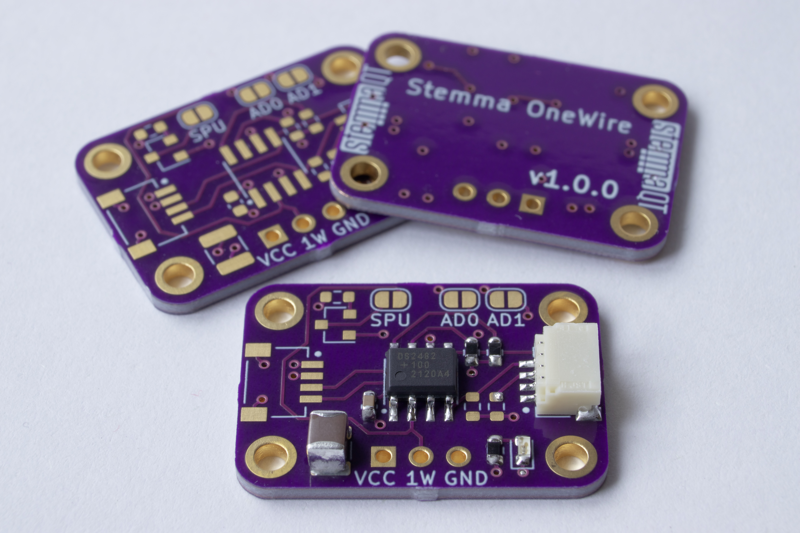

# DS2482 Stemma QT Board

## Usage with CircuitPython

Only a couple lines of python are required to make this board appear as a standard
`adafruit_onewire.bus.OneWireBus` object.

See: https://github.com/fgervais/ds2482

## OSHPark

<a href="https://oshpark.com/shared_projects/6VDPQxtW" target="_blank">https://oshpark.com/shared_projects/6VDPQxtW</a>
